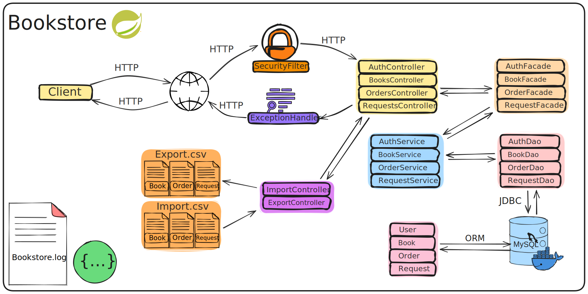

# Книжный магазин
Данный проект является доработанной версией проекта, разработанного в рамках учебного курса по Java-разработке от ООО "Сенла"

Исходную версию вы можете найти [здесь](https://github.com/nemk0ff/SenlaCourse/tree/main/4)

---
## Модернизация проекта
В рамках развития проекта была проведена комплексная модернизация архитектуры и инфраструктуры:

### Ключевые улучшения:
#### Миграция на Spring Boot:

- Переход с классического Spring MVC на Spring Boot 3.4.4 для упрощения конфигурации и ускорения разработки
- Автоматизация управления зависимостями через Spring Boot Starter POM
- Встроенный сервер Tomcat (замена standalone Tomcat)

#### Контейнеризация:
- Реализация Docker-образа приложения
- Оркестрация сервисов через docker-compose.yml:
- - Spring Boot приложение
- - MySQL база данных

#### Документирование API:
- Интеграция Swagger UI с кастомными настройками:
- Группировка эндпоинтов по функциональным блокам
- Примеры запросов/ответов
- JWT-аутентификация в документации
- Автогенерация OpenAPI 3.0 спецификации
-Визуализация архитектуры

#### Создание диаграммы компонентов:

